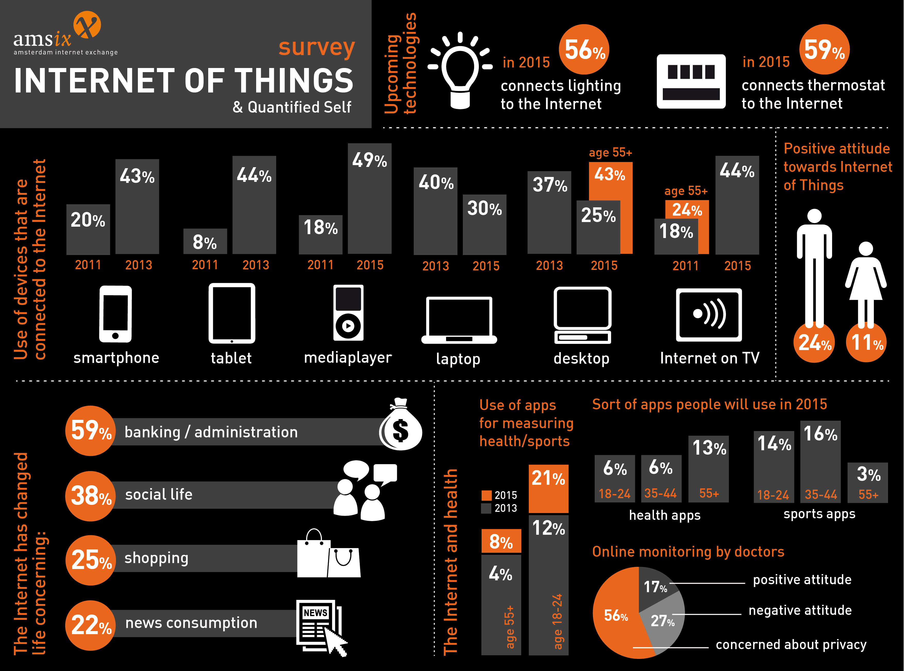

# 前端开发者可以做什么
# Front-end developers develop for...

一个前端编写 HTML，CSS 和 JS，运行在以下操作系统（OS） 的 web 平台上（比如：web 浏览器）
A front-end developer crafts HTML, CSS, and JS that runs on the web platform 
(e.g. a web browser) on one of the following operating systems (aka OS's):

* Windows
* Windows Phone
* OSX
* iOS
* Android
* Ubuntu (or some flavor of Linux)
* Chromium

这些操作系统一般运行在以下一种或多种设备上：
These operating systems typically run on one or more of the following devices:

* Desktop computer
* Laptop / Netbook computer
* Mobile phone
* Tablet
* TV
* Watch
* Things (i.e. anything you can imagine, car, refrigerator, lights, thermostat etc..)

<cite>image source: <a href="https://ams-ix.net/newsitems/87">https://ams-ix.net/newsitems/87</a></cite>

 一般来讲，前端技术可以基于如下运行环境中，而这些运行环境安装在之前提到的操作系统和设备上：
Generally speaking, front-end technologies can run on the aforementioned operating systems and devices using the following run time scenarios:

* 一个 web 浏览器 (例如: [Chrome, IE, Safari, Firefox](http://outdatedbrowser.com/en)) ，其运行在一个操作系统之上.
* A web browser (examples: [Chrome, IE, Safari, Firefox](http://outdatedbrowser.com/en)) running on an OS.
* 一个 [headless 浏览器](https://en.wikipedia.org/wiki/Headless_browser) (例如：[phantomJS](http://phantomjs.org/)), 其通过运行在一个操作系统上的命令行来使用.
* A [headless browser](https://en.wikipedia.org/wiki/Headless_browser) (examples [phantomJS](http://phantomjs.org/)) driven from a CLI running on an OS.
* 一个 [WebView](http://wiki.awesomium.com/general-use/introduction-to-web-views.html)/浏览器标签页（就像 iframe） 嵌在一个原生应用中，原生应用为它和原生 API 之间加起了桥梁。WebView 应用通常包含了一个基于 web 技术的 UI 架构。（比如： HTML，CSS 和 JS）(例如: [Apache Cordova](https://cordova.apache.org/), [NW.js](http://nwjs.io/), [Electron](http://electron.atom.io/))
* A [WebView](http://wiki.awesomium.com/general-use/introduction-to-web-views.html)/browser tab (think iframe) embedded within a native application as a runtime with bridge to native API's. WebView applications typically contain a UI constructed from web technologies. (i.e. HTML, CSS, and JS). (examples: [Apache Cordova](https://cordova.apache.org/), [NW.js](http://nwjs.io/), [Electron](http://electron.atom.io/))
* 一个基于 web 技术构建的原生应用通过一个原生 API's 桥来解释运行。UI 利用原生应用的 UI 技术（比如：iOS 原生空间）而不是 web 技术。(比如: [NativeScript](https://www.nativescript.org/), [React Native](https://facebook.github.io/react-native/))
* A native application built from web tech that is interpreted at runtime with a bridge to native API's. The UI will make use of native UI parts (e.g. iOS native controls) not web technologies. (examples: [NativeScript](https://www.nativescript.org/), [React Native](https://facebook.github.io/react-native/))

 

