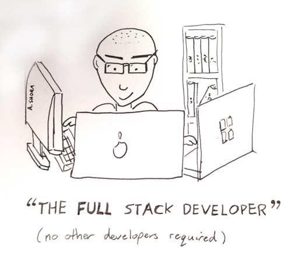
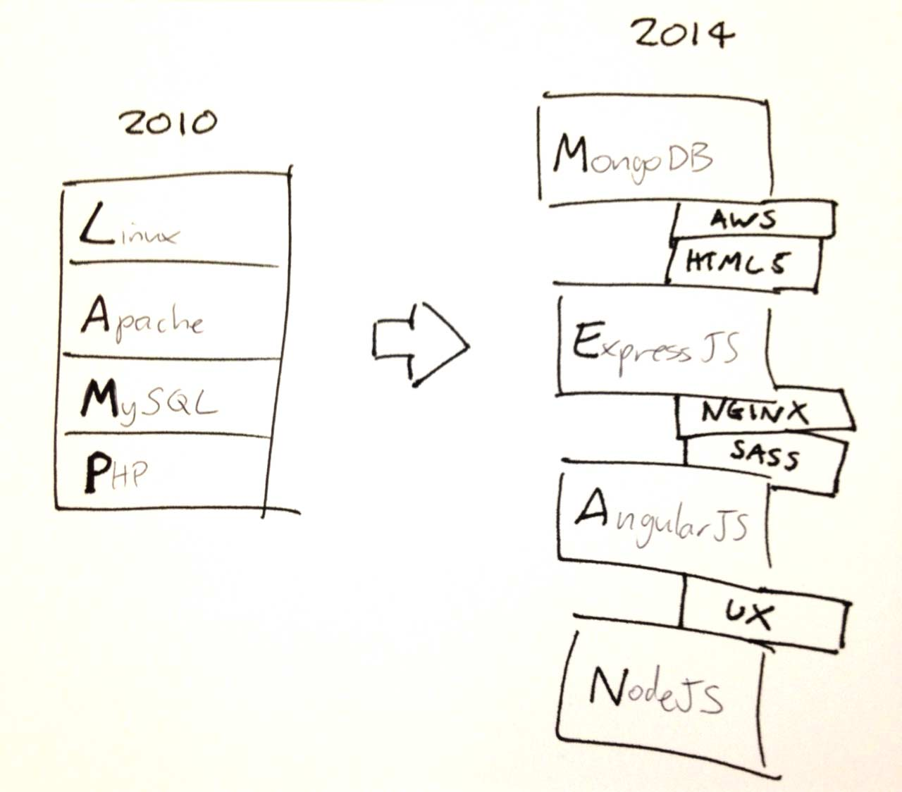

# 通才的秘密
# Generalist myth

<cite>image source: <a href="http://andyshora.com/full-stack-developers.html">http://andyshora.com/full-stack-developers.html</a></cite>

那些设计和开发一个 web 解决方案的角色需要在视觉设计，UI/交互设计，前端开发和后端开发方面有大量深入的技能。任何人（全栈开发者或设计师）能够在以上四种角色中具有专业水平是异常罕见。
The roles required to design and develop a web solution require a deep skill set and vast experience in the area of visual design, UI/interaction design, front-end development, and back-end development. Any person (aka generalist or full-stack developer/designer) who can fill one or more of these 4 roles at a professional level is a rare exception to the rule.

实事求是，你应该尝试去成为或尝试去雇佣某一方面的专拣。基于现代的技术栈来说，那些声称具备多种专业角色的人一场少见甚至像是神话。
Pragmatically, you should seek to be, or seek to hire, an expert in one of these roles. Those who claim to operate at an expert level at one or more of these roles are exceptionally rare and more than likely mythical, given modern stacks.

<cite>image source: <a href="http://andyshora.com/full-stack-developers.html">http://andyshora.com/full-stack-developers.html</a></cite>

 

